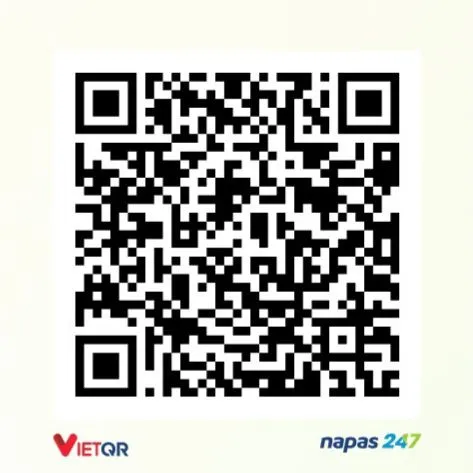

# Ext VBook W

Kho extension cho VBook và VBook Beta.

## Cách cài nguồn

1. Mở app VBook hoặc VBook Beta.
2. Vào **Quản lý nguồn** hoặc **Kho lưu trữ**.
3. Chọn thêm nguồn mới.
4. Dán link này:

```text
https://raw.githubusercontent.com/BaoBao666888/ext-vbook-w/main/plugin.json
```

5. Lưu lại, sau đó tải/cập nhật extension trong app.

## Lưu ý

- Các extension đọc truyện dùng được trên bản VBook thường.
- Các extension video chỉ xem được trên VBook Beta.
- Muốn dùng extension Qidian thì liên hệ Discord để lấy riêng.

## Liên hệ

Discord: `quocbao7276`
Email: `quocbao120621@gmail.com`

## Donate

Tiền thì ai không cần chứ ~, cảm ơn nếu bạn ủng hộ nhoa :>.


